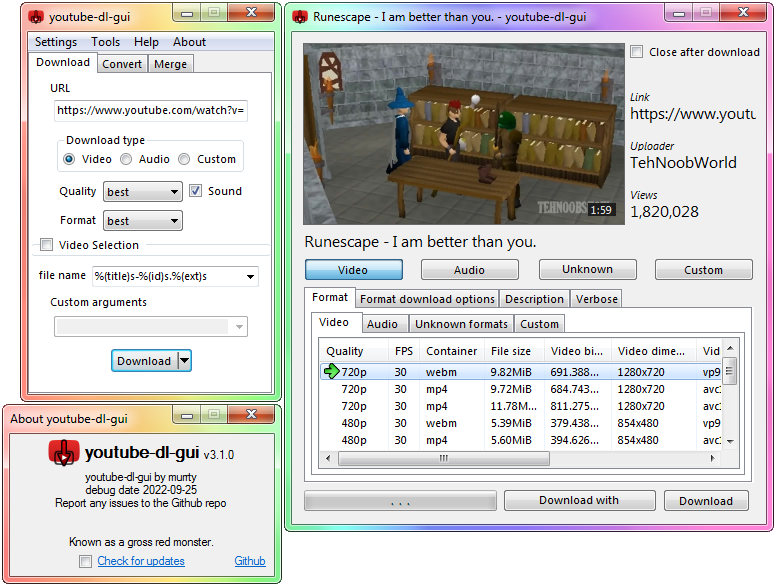

# youtube-dl-gui
GUI for [yt-dlp](https://github.com/yt-dlp/yt-dlp) ([youtube-dl](https://github.com/ytdl-org/youtube-dl) and [yt-dlc](https://github.com/blackjack4494/yt-dlc) are supported, but yt-dlp is suggested) + [ffmpeg](https://ffmpeg.org/) (ffmpeg.exe & ffprobe.exe) which is used for converting. [AtomicParsley](http://atomicparsley.sourceforge.net/) may be required for embedding data into files.

  
it may look different between versions

The goal of youtube-dl-gui is to make it as accessible to as many people as possible, with as many arguments added as options as I use them... or get requested to add them. If at all.

Powerusers can use the custom arguments option to have almost absolute control of the input arguments, excepting the URL and the output.

Additionally, [userscripts](USERSCRIPTS.md) can be used in conjunction with this program to extend functionality.

# Prerequisites
A Windows computer (or any computer) that has support for the **[.NET Framework 4.7.2 runtime](https://dotnet.microsoft.com/en-us/download/dotnet-framework/net472)**.

Youtube-dl (or any fork) may require ffmpeg to be present along side it.

# Usage
**On first start, be sure to read the dialogs.**

This program won't run without youtube-dl being in either the same directory as youtube-dl-gui, or in the system's PATH. It's designed to download youtube-dl for you if it does not find one.

If you want to use a schema, feel free to build your own using [the following useable replacement flags](https://github.com/ytdl-org/youtube-dl/blob/master/README.md#output-template) (perhaps i'll add a friendly way of building your own), or just stick to one of the default ones.

Downloading with custom formats and converting in any way will require FFmpeg, which you can download and put the files in "ffmpeg/bin/*.exe" in with the same directory as youtube-dl-gui or extract it anywhere and put the bin directory into your windows PATH.

The static paths for youtube-dl and ffmpeg may be set, which will allow you to select the executable, for youtube-dl, and/or the directory, for ffmpeg.

There are 2 ways to download media; the quick downloader and the extended downloader.

## Quick downloader
This is the original download form, and while doesn't provide specific formats to choose from, it relies on the main forms (or saved settings) to gather requested formats. It lays all the hard work onto youtube-dl to figure out the best formats for you. This is the only form that supports mass downloading (playlist, channel, etc) due to its' agnostic approach to formats and qualities.

## Extended downloader
This form gives you more information about the media you requested, such as all available formats, and any unknown formats that can additionally be downloaded. It also supports custom arguments, but if that is your choice of download, it'd be faster to use the quick downloader. It does not support mass downloading (playlist, channel, etc) and most likely will not work in that way.

# Custom Arguments
When using custom arguments, the url and save directory are automatically passed, url being the first thing passed, followed by custom arguments, and the save-to directory being the final one passed.

Examples:  
`youtube-dl.exe https://awebsite.tld/video.html \<custom arguments> -o "C:\Users\User\Downloads\"`  
`ffmpeg.exe -i "C:\Users\User\Downloads\VideoToConvert.ext" \<custom arguments> "C:\Users\User\Downloads\FileOutput.ext"`

Additionally, if you do include custom arguments on non-custom downloads, they will be appended to the end of the generated arguments, so you can use custom arguments along the generated arguments.

# Compatible sites
Each fork may have differences in compatible sites. It's recommended to do your own research. Or just try it, and see if it works. The worst that can happen is you blow up.

# Compiling
The project is built with any compiler that supports using C# 11 (Preview), .NET Framework 4.7.2, and WinForms.

The `Debug` configuration may disable certain actions from working. But it's the debug config, what do you expect?

# Dependancies
This project aims to be as independant as possible, losing functionaity in favor of portability, but functions that can be replaced with internal functions have and will be replaced.

## Linux
This project isn't targetting users who run Linux or GNU. It may be possible to run using Wine or Mono, but I wouldn't hold my breath.

# Contributing
For anyone looking to translate, feel free to open a pull request with the new language file in the `Language` folder. Check if a language you're translating exists already, and you can edit it off of that.

For anyone looking to contribute to the code, make a pull request with the changed code.

Finally, contributions to the project through alternative means, like `Userscripts` or browser extensions to increase functionality of using the program are welcome through pull requests for review & merge. You can create a pull-request to add a link to your user-script by editing the [userscripts markdown file](USERSCRIPTS.md) and adding your userscript(s), your username, and the sites supported to the main grid.

# What is that hyphen in the version number?
It deontes that the version is a preview version (internally called a beta version).

Something marked as `1.0.0` is not a preview version, but `1.0.1-1` is a preview version. Similarly, `1.0.1` is NOT a preview version because there's no hypened number appended to it.